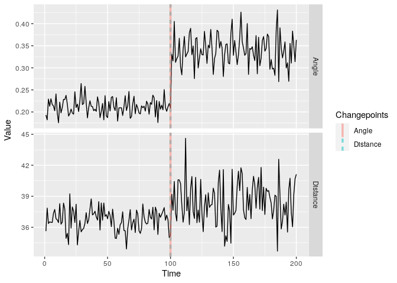

<!-- README.md is generated from README.Rmd. Please edit that file -->

# changepoint.geo

<!-- badges: start -->

[](https://CRAN.R-project.org/package=changepoint.geo)
[](https://r-pkg.org/pkg/changepoint.geo)
[](https://github.com/grundy95/changepoint.geo/actions)
[](https://codecov.io/gh/grundy95/changepoint.geo)
<!-- badges: end -->

The goal of changepoint.geo is to implement the high-dimensional
changepoint detection method GeomCP described in [Grundy et
al. (2020)](doi:10.1007/s11222-020-09940-y)

## Installation

You can install the released version of changepoint.geo from
[CRAN](https://CRAN.R-project.org) with:

``` r
install.packages("changepoint.geo ")
```

And the development version from [GitHub](https://github.com/) with:

``` r
# install.packages("devtools")
devtools::install_github("grundy95/changepoint.geo")
```

## Example

This is a basic example which shows you how to solve a common problem:

``` r
library(changepoint.geo )
#> Loading required package: changepoint
#> Loading required package: zoo
#> 
#> Attaching package: 'zoo'
#> The following objects are masked from 'package:base':
#> 
#>     as.Date, as.Date.numeric
#> Successfully loaded changepoint package version 2.2.2
#>  NOTE: Predefined penalty values changed in version 2.2.  Previous penalty values with a postfix 1 i.e. SIC1 are now without i.e. SIC and previous penalties without a postfix i.e. SIC are now with a postfix 0 i.e. SIC0. See NEWS and help files for further details.
#> Loading required package: changepoint.np
#> Loading required package: ggplot2
#> 
#>  Successfully loaded changepoint.geo package version 1.1.1
set.seed(1)
X <- rbind(matrix(rnorm(100*50),ncol=50),matrix(rnorm(100*50,0,2),ncol=50))
ans <- geomcp(X)
summary(ans)
#> Created using changepoint.geo version 1.1.1 
#> Univariate Test Stat :  Normal 
#> Type of penalty      :  MBIC  with value  21.19327 
#> Minimum Segment Length   :  2 
#> Distance Changepoints    :  100 
#> Angle Changepoints   :  100
plot(ans)
```



<!-- You'll still need to render `README.Rmd` regularly, to keep `README.md` up-to-date. `devtools::build_readme()` is handy for this. You could also use GitHub Actions to re-render `README.Rmd` every time you push. An example workflow can be found here: <https://github.com/r-lib/actions/tree/master/examples>. -->
